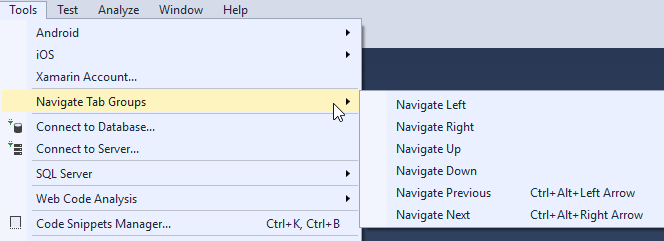

# Navigate Tab Groups
A Visual studio extension for switching to different tab groups.

[In this question](https://stackoverflow.com/questions/23381874/how-can-i-switch-to-a-different-tab-group-using-the-keyboard-in-visual-studio-20) someone wants to switch between different tab groups in Visual Studio; currently there is no built-in way to do so, so this extension adds a way.

[Download from Visual Studio Marketplace](https://marketplace.visualstudio.com/vsgallery/ffdfde72-5ca0-4296-9d65-1ef608ae4ac1)

## Exposed Commands

Exposes various commands for navigating between tab groups:

| Command                         | Description                              |
| ------------------------------- | ---------------------------------------- |
| `Tools.NavigateTabGroups.Right` | Moves to tab group to the **left** of the current group |
| `Tools.NavigateTabGroups.Left`  | Moves to tab group to the **right** of the current group |
| `Tools.NavigateTabGroups.Up`    | Moves to tab group **above** the current group |
| `Tools.NavigateTabGroups.Down`  | Moves to tab group **below** the current group |
| `Tools.NavigateTabGroups.Next`  | Moves to **next** tab group in the list. |
| `Tools.NavigateTabGroups.Right` | Moves to **previous** tab group in the list |

It also exposes all of the above via the Tools menu:

It also assigns a default keyboard shortcut to `Tools.NavigateTabGroups.Previous` (`CTRL+ALT+Left`) and  `Tools.NavigateTabGroups.Next` (`CTRL+ALT+Right`)

# Contributors

- [Mackenzie Zastrow](https://github.com/zastrowm) - current maintainer
- [Magnus Österlind](https://github.com/mrdooz) - [Original Creator](https://github.com/mrdooz/TabGroupJumperVSIX)
- [Dongwoon Son](https://github.com/dplusic) - [Added support for VS2015+](https://github.com/dplusic/TabGroupJumperVSIX)